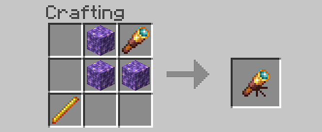
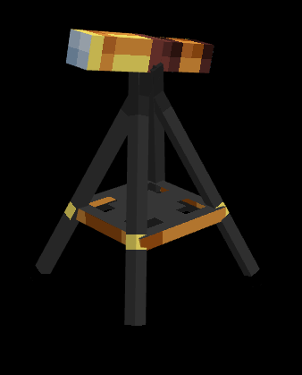

# Stargazers

A Minecraft Bedrock Edition Add-On started for the Bedrock Add-Ons 8k member jam! This Add-On isn't finished and I will work on it more in the future...

## Features

### General

This Add-On was made solo, for the Bedrock Add-Ons 8k member jam. It may not add much content in game, but quite some time was spent prototyping and refining the included features.

- 8 custom particles
- 2 custom sounds
- Built mainly with Gametest
- Custom progress indicator UI
- Custom textures and models
- And more...

Built for 1.19.10 (latest release build) with Holiday Creator Features and GameTest Framework experimental toggles enabled.

### Telescope

This Add-On is based around the idea of **stargazing**; for this, you can craft a telescope with the following recipe:

A telescope can be interacted with to enter a [starfield](#starfield), assuming the following conditions are met:

- The player is in the overworld.
- It is midnight.
- No player has already entered a starfield in the current night.
- There is no player already stargazing.

### Starfield

When entering a starfield you must search for the **Magical Star** and look at it with the spyglass. This will cause the star to fall down to the ground. As an added ambient effect, you will see comets shooting through space while in a starfield.

### Star Events

Once you have a star on the ground, you can interact with it. This will trigger a random event. Currently there are 3 available events:

- Be blessed with positive potion effects.
- Be cursed with negative potion effects.
- Open a [rift](#rift), where waves of mobs will spawn and you must fight them for a reward.

More events will be added in the future.

### Rift

A rift is a crack between worlds, where enemies will flood through over 3 waves. Once completed, you will be granted some rewards :D

---

Made with [bridge.](https://bridge-core.app/), [BlockBench](https://www.blockbench.net/) and [Snowstorm](https://snowstorm.app/)